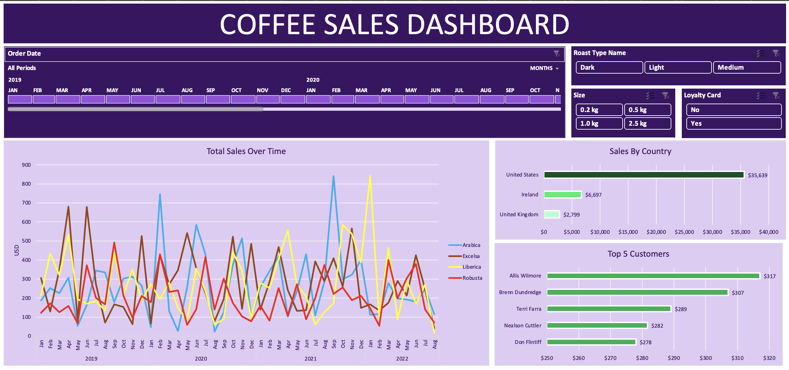

# Excel-Cofee-data-analysis

This project utilizes Excel to perform a comprehensive analysis of coffee orders data. It showcases various Excel functions and features to manipulate and present data effectively.

## Project Description

Starting with a simple dataset of coffee orders, this project explores advanced Excel techniques to transform raw data into insightful visualizations and reports. The repository includes step-by-step tutorials on how to apply each function, making it ideal for Excel learners and advanced users looking to refine their skills.

### Features Demonstrated

1. **XLOOKUP** - Used for efficiently searching data.
2. **INDEX & MATCH** - An alternative to VLOOKUP that provides flexibility in data retrieval.
3. **Multiplication Formula** - To calculate sales figures from unit price and quantities.
4. **Multiple IF Functions** - For complex conditional operations within cells.
5. **Date Formatting** - Customizing date displays to suit reporting needs.
6. **Number Formatting** - Enhancing data presentation through number formatting.
7. **Duplicate Check** - Identifying and handling duplicate entries.
8. **Convert Range to Table** - Organizing data into a structured table format.
9. **Pivot Tables and Charts** - Summarizing data visually and statistically.
10. **Timeline and Slicers** - Interactive tools for dynamic data exploration.
11. **Dashboard Building** - Integrating various data visualizations into a cohesive dashboard.

## Final Dashboard

Here is what the final dashboard looks like after applying the Excel techniques:

## Installation

No installation is required, as the project is done entirely in Excel. However, you will need Microsoft Excel (version 2016 or later recommended) to open and interact with the provided `.xlsx` files.

## Usage

Each feature listed above corresponds to a tutorial within the Excel workbook. Navigate through each sheet to see the functions applied in real scenarios:

- Time stamps in the workbook correlate with specific features, guiding you through the process step-by-step.
- Feel free to modify the data and formulas to see different outcomes and understand the mechanics of each function.

Thank you for exploring the Coffee Orders Analysis project!
